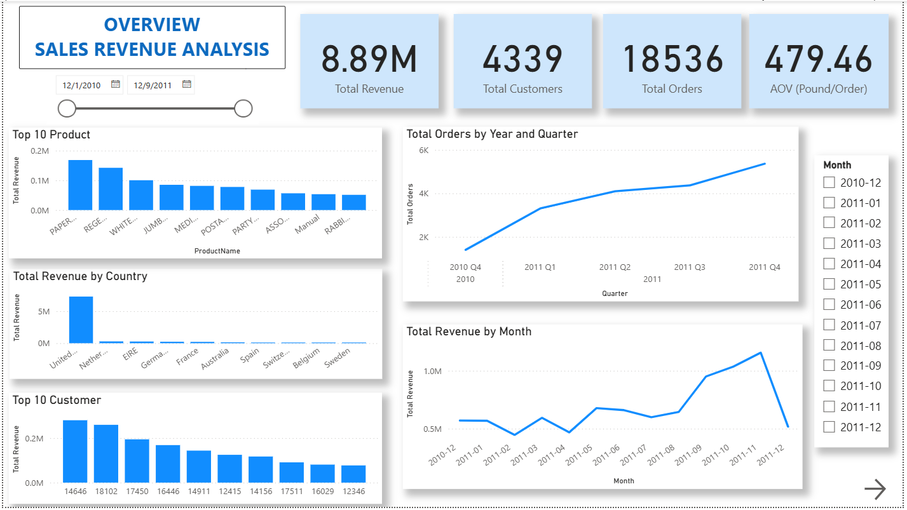
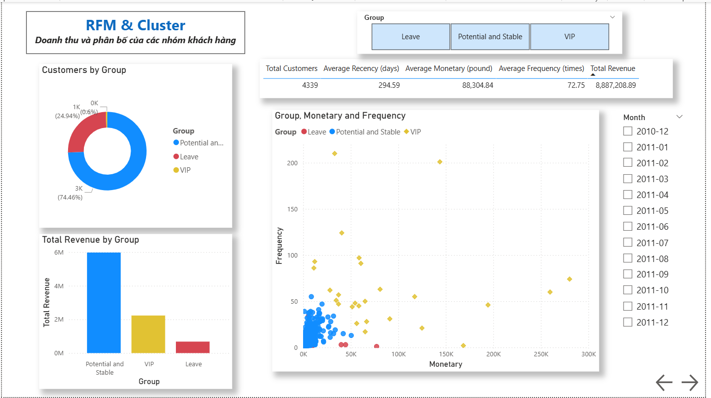

# Customer-behavior-analysis-and-revenue-forecasting

## 1) Mục tiêu dự án:

- Phân khúc khách hàng dựa vào hành vi mua hàng của họ
- Dự đoán doanh thu dưới sự tác động của các chiến dịch ứng với từng nhóm khách hàng

## 2) Dữ liệu:

- Bộ dữ liệu được lấy từ UCI Machine Learning. Đường link: https://archive.ics.uci.edu/dataset/352/online+retail. Bộ dữ liệu bao gồm tập hợp các giao dịch của các khách hàng từ 1/12/2010 đến 9/12/2011 ở UK của một công ty bán lẻ trực tuyến không thông qua cửa hàng. Công ty chủ yếu bán các món hàng quà tặng độc đáo và khách hàng đa số là các nhà buôn bán sỉ.

## 3) Công cụ:

- Các thư viện trong python như:
    + pandas để xử lý dữ liệu
    + matplotlib và seaborn để trực quan hóa dữ liệu
    + scikit-learn để xây dựng mô hình phân khúc khách hàng
- Jupyter Notebook để trình bày code, kết quả và kết luận 

## 4) Phương pháp:

- Xử lý dữ liệu bị thiếu, bị lặp và các dòng có quantity âm.
- Tạo thêm các features mới để tính toán như TotalRevenue, Recency, Frequency, Monetary.
- Sử dụng K-means để phân khúc khách hàng 

## 5) Dashboard

- Sử dụng Power BI để trình bày sâu hơn về dữ liệu. Link Power BI Service: https://app.powerbi.com/links/aM35kkihLh?ctid=40127cd4-45f3-49a3-b05d-315a43a9f033&pbi_source=linkShare

- Một vài hình ảnh về Dashboard:

## 6) Kết quả dự án

- Phân khúc khách hàng trong bộ dữ liệu thành 3 nhóm. Nhóm Leave, Potential and Stable, VIP. Từng nhóm sẽ có những chiến dịch phù hợp khác nhau để có thể gia tăng doanh số.

- Hiểu được những khách hàng trong từng nhóm có những hành vi mua hàng tương đồng nhau.
